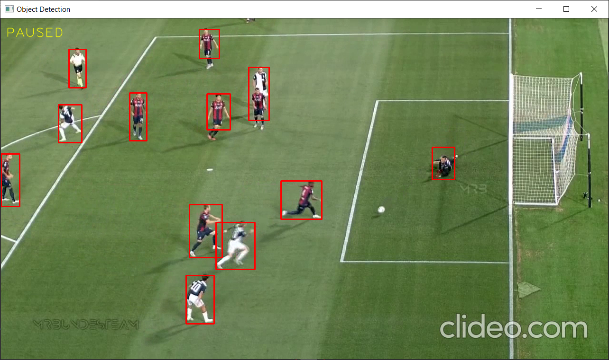
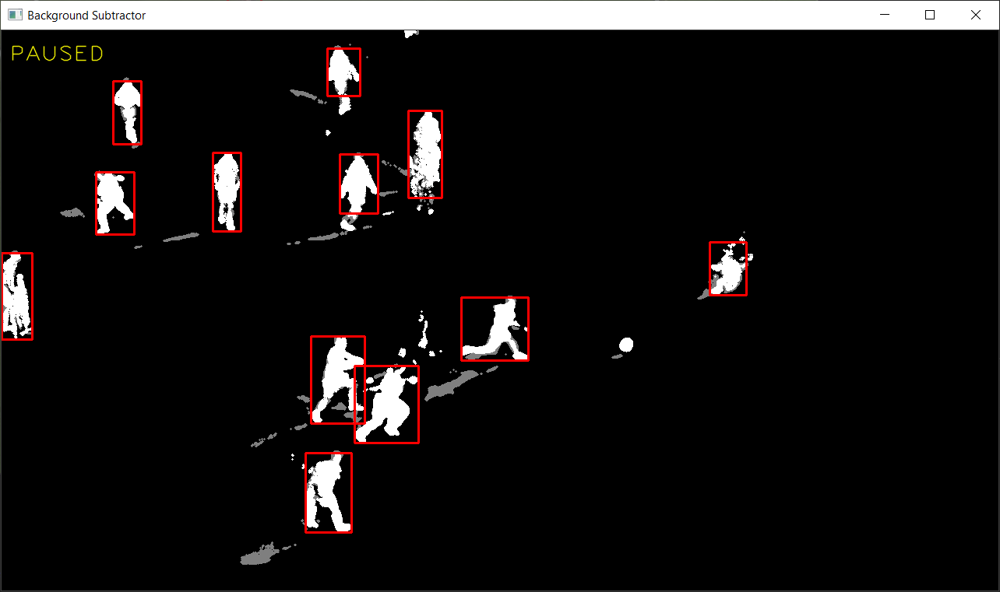

# Moving-Object-Detection-app
This is an app that detects moving objects using backround subtraction. 

This app uses background subtraction to create a primitive mask. For that mask, we use an elliptical kernel to eliminate artifacts, we apply the "open" morphological transformation. The next step transforms the grayscale image into a binary image using a threshold of 200 out of 255. By doing this, the program gets rid of the shadows that were initially detected by the background subtractor. 

Finally, we search for the contours to fit the detected moving objects in a bounding box.

Results: 

